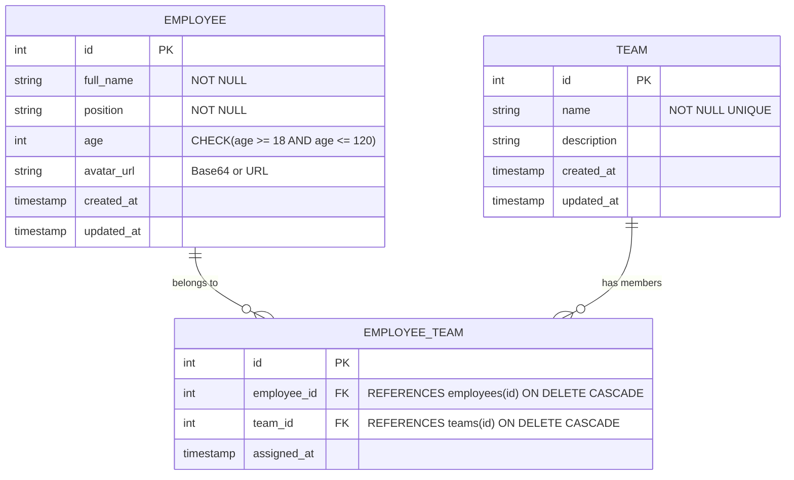
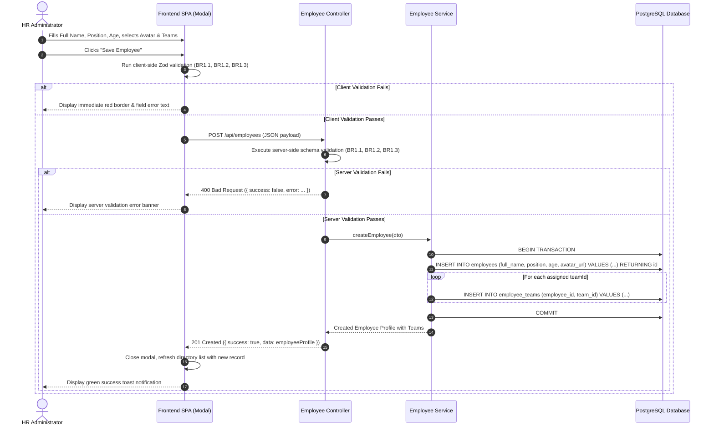
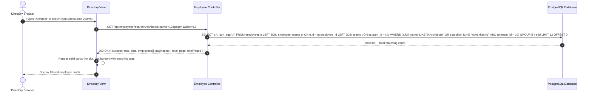

# Functional Specification: Employee Directory (u01-employee-directory)

## 1. Domain Overview & Responsibilities

Unit `u01-employee-directory` provides the personnel directory and profile management subsystem for the Employee Management System. It manages the lifecycle of employee records, validates demographic data according to enterprise and regulatory policies (PDPA), processes profile photos as Base64/URL assets, and delivers responsive search, team filtering, and dual-mode directory browsing (Card Grid and Table views).

---

## 2. Entity-Relationship Model (Derived View)

---

## 3. Workflows & State Machines

### 3.1 Use Case UC-01: Create Employee Profile
**Actor**: HR Administrator / Team Lead
**Trigger**: User clicks "Add Employee" button, fills in profile form modal, and submits.

#### Step Sequence:
1. **Input Submission**: Client submits `fullName`, `position`, `age`, optional `avatarUrl` (Base64 string), and optional array of `teamIds`.
2. **Validation**: Validates name length (≥2 chars), position (≥2 chars), age (18..120), and avatar data size (≤5MB).
3. **Atomic Persistence**: Begins database transaction, inserts row into `employees` table, creates junction rows in `employee_teams` for all supplied `teamIds`, and commits transaction.
4. **Response**: Returns normalized `EmployeeProfile` including resolved team objects.

---

### 3.2 Use Case UC-02: Search & Filter Directory
**Actor**: Any User
**Trigger**: User types search keyword into the search input or selects a team from the filter dropdown.

#### Step Sequence:
1. **Query Formulation**: Extracts `search`, `teamId`, `page`, and `limit` query parameters from the request.
2. **Query Execution**: Executes parameterized query with `ILIKE` substring search on name/position (BR1.4) and optional `team_id` filter (BR1.5).
3. **Result Aggregation**: Groups team affiliations per employee as embedded array.
4. **Response Delivery**: Returns structured payload with `data` array and pagination metadata (BR1.7).

---

### 3.3 Use Case UC-03: Delete Employee Profile
**Actor**: HR Administrator
**Trigger**: User confirms deletion on an employee card or detail modal.

#### Step Sequence:
1. **Validation & Existence Check**: Verifies employee ID exists in PostgreSQL.
2. **Transactional Removal**: Executes `DELETE FROM employee_teams WHERE employee_id = :id` followed by `DELETE FROM employees WHERE id = :id` (BR1.6).
3. **Response**: Returns `{ success: true, message: "Employee deleted successfully" }`.

---

## 4. Derived Business Rules Summary

| Rule ID | Statement | Category | Target | Source |
|---|---|---|---|---|
| **BR1.1** | Name & Position validation (min 2 chars, non-empty) | Validation | `employees.full_name`, `employees.position` | FR-1.1, AC1.1.1, AC1.1.2 |
| **BR1.2** | Age validation (integer between 18 and 120) | Validation | `employees.age` | FR-1.1, AC1.1.1, AC1.1.2 |
| **BR1.3** | Avatar image format & payload constraint (max 5MB) | Validation | `employees.avatar_url` | FR-1.1, FR-1.4, AC1.1.1 |
| **BR1.4** | Real-time case-insensitive search by name & position | Policy | Search endpoint | FR-1.3, AC1.2.1 |
| **BR1.5** | Team filter matching via junction table | Policy | Directory query | FR-1.3, AC1.2.2 |
| **BR1.6** | Transactional cascade delete for employee memberships | Constraint | Delete endpoint | FR-1.2, NFR-2 |
| **BR1.7** | Server-side pagination and count metadata calculation | Calculation | Directory list | FR-1.3, NFR-1 |

