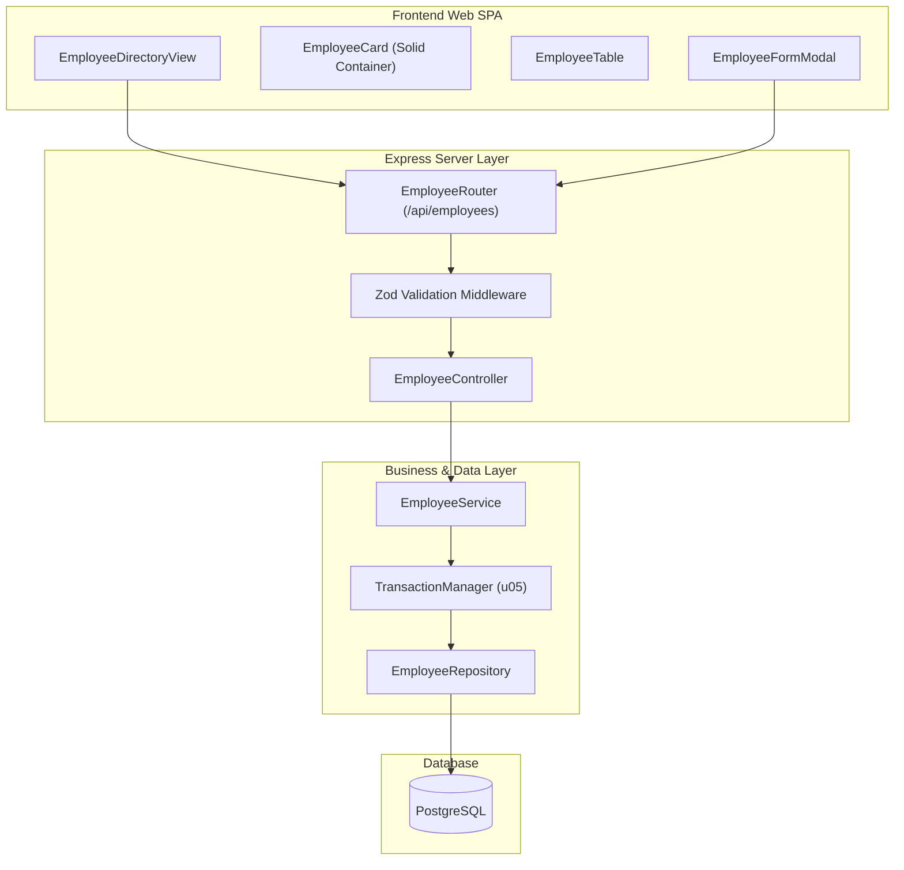

# Logical Component Inventory: Employee Directory (u01-employee-directory)

## 1. Component Boundaries & Responsibilities

---

## 2. Component Inventory & Blast Radius

| Component | Layer | Scope & Responsibilities | Failure Domain & Blast Radius |
|---|---|---|---|
| `EmployeeController` | API | HTTP parsing, query parameters, status mapping | Isolated to `/api/employees` endpoints |
| `EmployeeService` | Domain | Multi-table orchestration, business logic | Internal domain layer; isolated to personnel mutations |
| `EmployeeRepository` | Data Access | Parameterized SQL queries, connection pool usage | Database query boundary; transient DB errors handled via TxMgr |
| `EmployeeDirectoryView` | Presentation | Search debounce, view mode toggle, state management | Client SPA view; rendering errors captured by React ErrorBoundary |

