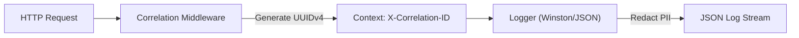

# Observability Design: Employee Directory (u01-employee-directory)

## 1. Structured Logging & Context Propagation



### 1.1 Log Schema Specification
```json
{
  "level": "info",
  "timestamp": "2026-10-07T07:30:00.000Z",
  "correlationId": "d3b07384-d113-4a1e-8e8e-9080b06b2d18",
  "message": "Employee profile created successfully",
  "context": {
    "employeeId": 42,
    "teamCount": 2,
    "durationMs": 34,
    "method": "POST",
    "path": "/api/employees"
  }
}
```

---

## 2. Error Classification & Handling

- `ValidationError` &rarr; HTTP 400 with field details.
- `NotFoundError` &rarr; HTTP 404 with resource identifier.
- `DatabaseError` &rarr; HTTP 500 in production, logs root cause without leaking connection strings.

