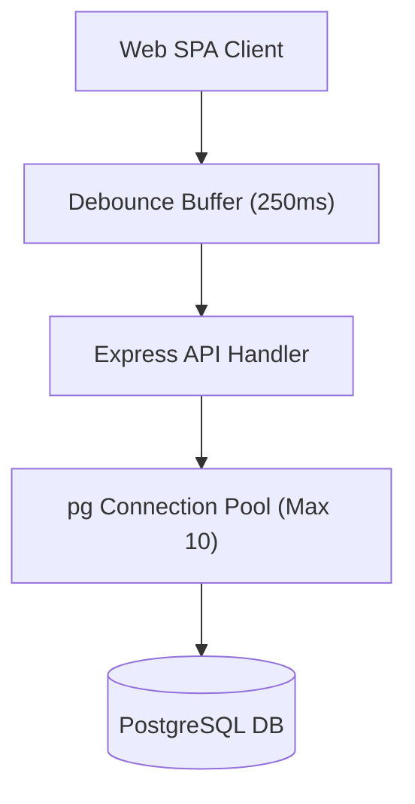

# Performance Design: Employee Directory (u01-employee-directory)

## 1. Architectural Strategy & Query Optimization

- **Single Parameterized Query Strategy**: Directory queries combine `employees` and `teams` via `LEFT JOIN employee_teams` and `LEFT JOIN teams` using PostgreSQL `json_agg()` to eliminate N+1 round trips.
- **Client Search Debounce**: UI search inputs debounce API invocations by 250ms, preventing request storms during rapid typing.
- **Connection Pool Sizing**:
  - `min`: 2 idle connections
  - `max`: 10 active connections
  - `idleTimeoutMillis`: 30,000ms
  - `connectionTimeoutMillis`: 5,000ms

---

## 2. Performance Budgets & SLA Allocations

| Operation | Latency Budget (P95) | Target Query Execution | Network & Serialization Budget |
|---|---|---|---|
| Search / List Employees | < 200ms | < 35ms (Indexed Scan) | < 65ms |
| Create / Update Employee | < 250ms | < 45ms (Transaction) | < 55ms |
| Delete Employee | < 150ms | < 25ms (Cascade) | < 45ms |

