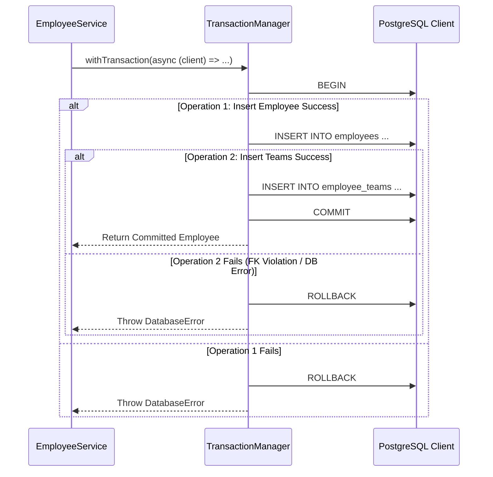

# Reliability & Resilience Design: Employee Directory (u01-employee-directory)

## 1. Transaction Safety & Cascade Resilience

---

## 2. Health Monitoring & Graceful Degradation

- **Database Health Check**: `/api/health` queries `SELECT 1` with a 2-second timeout to verify database connectivity.
- **Graceful Shutdown**: On `SIGTERM` / `SIGINT`, server stops accepting new connections, waits for in-flight requests to complete (timeout 5s), and closes PostgreSQL pool cleanly.

