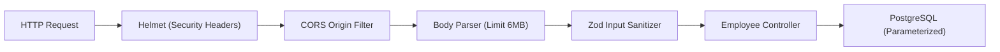

# Security & Compliance Design: Employee Directory (u01-employee-directory)

## 1. Security Architecture & Middleware Pipeline

### 1.1 Security Headers & Protection Controls
- **Helmet Middleware**: Injects `Content-Security-Policy`, `X-Content-Type-Options: nosniff`, `X-Frame-Options: DENY`, `Strict-Transport-Security`.
- **CORS Configuration**: Restricts origins to trusted developer and preview hosts (`http://localhost:3000`, `http://localhost:5173`).
- **Body Limit**: Enforces 6MB maximum payload ceiling to protect against DoS while accommodating 5MB Base64 avatars.

### 1.2 Input Sanitization & PDPA Protection
- **Zod Schema**: Validates all incoming payloads before controller execution. Trims strings, strips control characters, validates Base64 image headers.
- **SQL Injection Prevention**: 100% parameterized queries via `$1, $2, ...` syntax. Zero string concatenation in query builder.
- **PII Redaction**: Logs redact employee full name, age, and raw avatar bytes in application logs.

