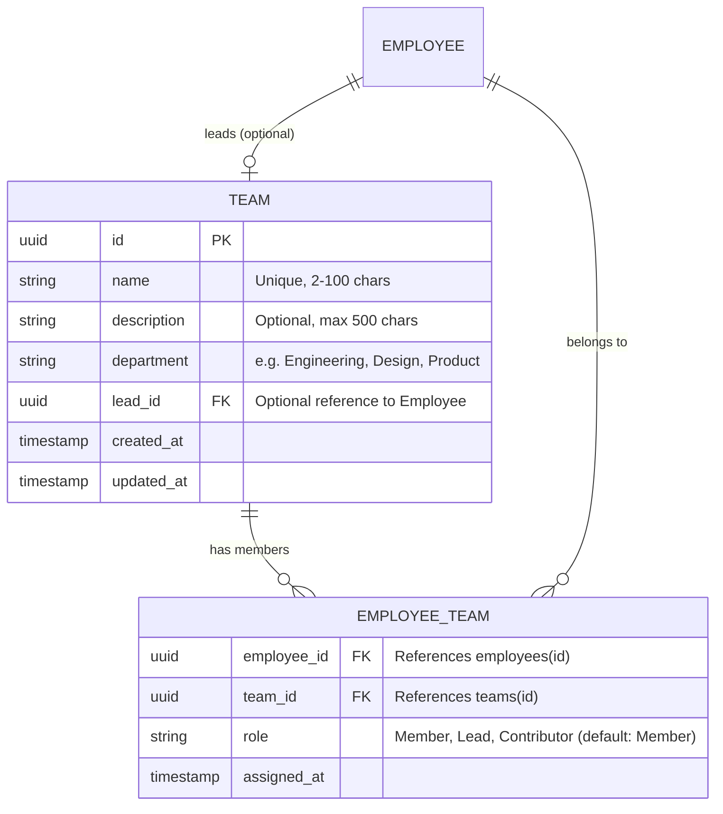

# Domain Entity Models — Unit 02 (Team Rosters & Allocations)

## Entity Architecture
Unit 02 manages organizational teams, member rosters, and many-to-many allocation relationships between employees and teams.

## Entity Specifications

### 1. `Team` Entity
- **`id`** (`UUID`): Primary key, generated via `uuid_generate_v4()` or `gen_random_uuid()`.
- **`name`** (`VARCHAR(100)`): Unique name of the team (e.g., "Core Infrastructure", "Mobile Frontend"). Required, trimmed, minimum 2 characters.
- **`description`** (`TEXT`): Optional description of team responsibilities, max 500 characters.
- **`department`** (`VARCHAR(100)`): Department category (e.g. `Engineering`, `Design`, `Product`, `Operations`, `QA`).
- **`lead_id`** (`UUID` FK &rarr; `employees.id`): Optional employee designated as the Team Lead.
- **`created_at`** (`TIMESTAMPTZ`): Timestamp of creation.
- **`updated_at`** (`TIMESTAMPTZ`): Timestamp of last modification.

### 2. `EmployeeTeam` Join Entity (`employee_teams`)
- **`employee_id`** (`UUID` FK &rarr; `employees.id`): References the employee. Cascades on employee deletion.
- **`team_id`** (`UUID` FK &rarr; `teams.id`): References the team. Cascades on team deletion.
- **`role`** (`VARCHAR(50)`): Team role designation (`Lead`, `Core Member`, `Contributor`). Default: `Core Member`.
- **`assigned_at`** (`TIMESTAMPTZ`): Timestamp when employee was added to the team.
- **Primary Key Constraint**: Composite `PRIMARY KEY (employee_id, team_id)`.

### 3. `TeamWithMembers` Aggregate / DTO
- Includes team properties, member count, team lead summary (`id`, `fullName`, `email`, `avatarUrl`), and an array of assigned members with their team roles.
