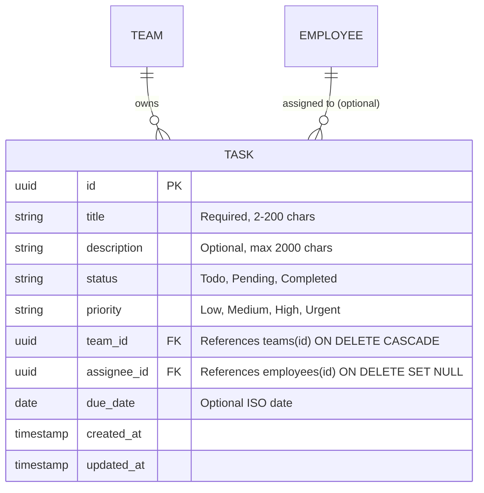

# Domain Entity Models — Unit 03 (3-Stage Team Task Board)

## Entity Architecture

---

## Entity Specifications

### 1. `Task` Entity
- **`id`** (`UUID`): Primary key (`gen_random_uuid()`).
- **`title`** (`VARCHAR(200)`): Required task summary, 2 to 200 characters.
- **`description`** (`TEXT`): Optional task details and acceptance criteria, max 2000 characters.
- **`status`** (`VARCHAR(20)`): Finite state status (`Todo`, `Pending`, `Completed`). Default: `Todo`.
- **`priority`** (`VARCHAR(20)`): Priority level (`Low`, `Medium`, `High`, `Urgent`). Default: `Medium`.
- **`team_id`** (`UUID` FK &rarr; `teams.id`): Required foreign key to the owning team. Cascades on team deletion.
- **`assignee_id`** (`UUID` FK &rarr; `employees.id`): Optional employee assigned to the task. Set to `NULL` if employee profile is deleted.
- **`due_date`** (`DATE`): Optional target completion date (`YYYY-MM-DD`).
- **`created_at`** (`TIMESTAMPTZ`): Creation timestamp (`CURRENT_TIMESTAMP`).
- **`updated_at`** (`TIMESTAMPTZ`): Last modified timestamp (`CURRENT_TIMESTAMP`).

### 2. `TaskWithDetails` Aggregate / DTO
- Combines task fields with `teamName`, `assigneeName`, and `assigneeAvatarUrl` resolved via SQL joins.

