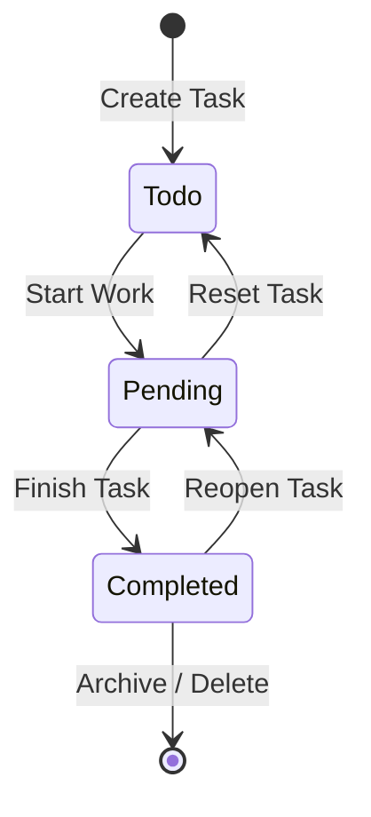

# Functional Specification — Unit 03 (3-Stage Team Task Board)

## Overview & Scope
Unit 03 (`u03-task-board`) provides comprehensive task lifecycle management for teams across the organization. It introduces a Kanban-style task tracking system governed by a strict 3-stage finite state machine (`Todo` → `Pending` → `Completed`), team assignment, priority tagging (`Low`, `Medium`, `High`, `Urgent`), due date tracking, and real-time stage progression.

---

## Finite State Machine (FSM)



- **Valid Statuses**: `Todo`, `Pending`, `Completed` (case-sensitive string literal union).
- **Default Status on Creation**: `Todo`.

---

## REST API Contracts

### 1. `GET /api/tasks`
- **Query Parameters**:
  - `teamId` (optional UUID): Filter tasks belonging to a specific team.
  - `status` (optional string): Filter by status (`Todo`, `Pending`, `Completed`).
  - `priority` (optional string): Filter by priority (`Low`, `Medium`, `High`, `Urgent`).
  - `assigneeId` (optional UUID): Filter tasks assigned to a specific employee.
  - `search` (optional string): Substring search on task title and description.
- **Response**: `200 OK`
  ```json
  {
    "success": true,
    "data": [
      {
        "id": "uuid",
        "title": "Migrate PostgreSQL Connection Pool",
        "description": "Configure maximum connections and idle timeouts",
        "status": "Todo",
        "priority": "High",
        "teamId": "team-uuid",
        "teamName": "Core Infrastructure",
        "assigneeId": "employee-uuid",
        "assigneeName": "Marcus Vance",
        "assigneeAvatarUrl": null,
        "dueDate": "2026-10-20",
        "createdAt": "2026-10-07T08:00:00Z",
        "updatedAt": "2026-10-07T08:00:00Z"
      }
    ],
    "total": 1
  }
  ```

### 2. `GET /api/tasks/:id`
- **Response**: `200 OK` with full task details, or `404 Not Found`.

### 3. `POST /api/tasks`
- **Request Body**:
  ```json
  {
    "title": "Implement PDPA Audit Logging",
    "description": "Add structured audit trail for avatar and employee modifications",
    "teamId": "team-uuid",
    "assigneeId": "optional-employee-uuid",
    "priority": "Medium",
    "status": "Todo",
    "dueDate": "2026-10-25"
  }
  ```
- **Response**: `201 Created` with created task object.

### 4. `PUT /api/tasks/:id`
- **Request Body**: Partial or full update payload (`title`, `description`, `teamId`, `assigneeId`, `priority`, `status`, `dueDate`).
- **Response**: `200 OK` or `404 Not Found` / `400 Bad Request`.

### 5. `PATCH /api/tasks/:id/status`
- **Request Body**:
  ```json
  {
    "status": "Pending"
  }
  ```
- **Response**: `200 OK` with updated task, or `400 Bad Request` if invalid transition.

### 6. `DELETE /api/tasks/:id`
- **Response**: `200 OK` (`{ "success": true, "message": "Task deleted successfully" }`).

---

## User Interface Specification (Task Board Tab)

1. **Top Navigation Tab**: "Tasks" tab alongside "Employees" and "Teams".
2. **Team & Status Filters**: Team selector dropdown, search input, and priority filter.
3. **3-Column Kanban Board Layout**:
   - Column 1: **Todo** (`#3b82f6` blue accent)
   - Column 2: **Pending** / In Progress (`#f59e0b` amber accent)
   - Column 3: **Completed** (`#10b981` emerald accent)
4. **Solid Task Cards**:
   - Title and description preview.
   - Team badge and Priority badge (`Low`, `Med`, `High`, `Urgent`).
   - Assignee avatar + name (or "Unassigned").
   - Due date indicator (with overdue warning styling).
   - Quick stage transition buttons (`→ In Progress`, `✓ Done`, `↺ Reopen`).
5. **Add / Edit Task Modal**: Clean form with team selection, title, description, priority, assignee, and due date picker.
