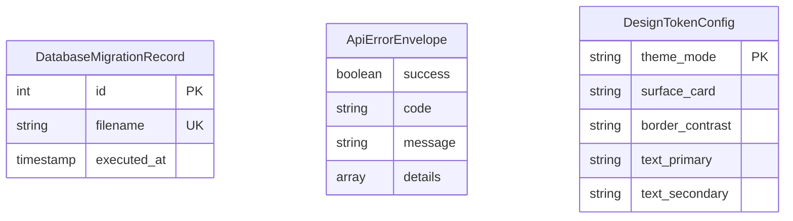

# Functional Specification — Unit U05 (u05-core-foundation)

## Sources
- Entities: `entities.md` (functional-design)
- Rules: `rules.md` (functional-design)
- Stories: `stories.md` (user-stories) — US5.1, US5.2
- Contracts: `contract-summary.md` (contract-design)

---

## 1. System Workflows & Behavioral Step Sequences

### Workflow 1: Database Bootstrap & Schema Migration Execution
1. Application initializes and calls `runMigrations()`.
2. Connection pool (`pg.Pool`) attempts connection to PostgreSQL server.
3. Migration runner checks for existence of `migrations` tracking table:
   - If not found, creates `migrations` table.
4. Runner reads SQL migration files from `/migrations` directory in alphabetical/numerical order.
5. For each file not recorded in `migrations`:
   - Begins a database transaction (`BEGIN`).
   - Executes DDL statements (creating `employees`, `teams`, `employee_teams`, `tasks`, indexes, and constraints).
   - Inserts record into `migrations` table with filename and timestamp.
   - Commits transaction (`COMMIT`).
6. Migration completes and logs successful schema verification.

### Workflow 2: Transactional Operation Lifecycle
1. Feature service initiates multi-table write (e.g. employee creation + team assignment).
2. Service passes callback function to `withTransaction(callback)`.
3. `withTransaction` acquires client connection from pool and issues `BEGIN`.
4. Callback executes queries using the transactional client.
5. If callback resolves without error:
   - Issues `COMMIT`.
   - Releases client back to pool.
   - Returns result to caller.
6. If callback throws an exception:
   - Issues `ROLLBACK`.
   - Releases client back to pool.
   - Re-throws error to be caught by error handling middleware.

### Workflow 3: REST API Error Interception & Enveloping
1. Client sends HTTP request to REST API endpoint.
2. Route handler or service throws `ApiError(statusCode, code, message, details)`.
3. Express router forwards error to global error middleware.
4. Middleware formats response:
   - Sets HTTP response status code to `statusCode` (e.g. 400 for validation, 404 for not found).
   - Constructs JSON payload `{ success: false, error: { code, message, details } }`.
   - Sends JSON response to client.

---

## 2. Derived Entity-Relationship Diagram

---

## 3. Derived Rules Summary

| Rule ID | Statement | Enforced By |
|---|---|---|
| **BR5.1** | Idempotent schema migration & foreign key setup | Migration Runner |
| **BR5.2** | Solid opaque card styling & zero glassmorphism | CSS / Tailwind Theme Config |
| **BR5.3** | Standardized JSON REST error envelope | Global Error Middleware |
| **BR5.4** | ACID transaction isolation and automatic rollback | Database Helper (`withTransaction`) |
