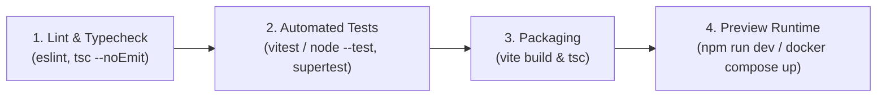

# CI/CD Pipeline & Container Infrastructure — Unit U05 (u05-core-foundation)

## Sources
- Logical Components: `logical-components.md` (nfr-design)
- Tech Stack Decisions: `tech-stack-decisions.md` (nfr-requirements)
- Security Requirements: `security-requirements.md` (nfr-requirements)
- Team Practices: `team-practices.md` (practices-discovery)

---

## 1. CI/CD Pipeline Architecture



---

## 2. Pipeline Execution Stages

| Stage # | Stage Name | Automated Command | Quality Gate Pass Criteria |
|---|---|---|---|
| **1** | Static Analysis & Type Checking | `npm run lint && npm run typecheck` | 0 ESLint errors, 0 TypeScript compilation errors. |
| **2** | Automated Testing | `npm test` | 100% test pass rate for all unit and REST API integration tests. |
| **3** | Build Packaging | `npm run build` | Clean client bundle and server transpilation without bundle warnings. |
| **4** | Container Runtime | `docker compose up -d` | PostgreSQL container health check reports `healthy` on port 5432. |

---

## 3. Local PostgreSQL Container Infrastructure (`docker-compose.yml`)

```yaml
version: '3.8'

services:
  postgres:
    image: postgres:16-alpine
    container_name: employee_management_db
    restart: unless-stopped
    environment:
      POSTGRES_DB: employee_management
      POSTGRES_USER: postgres
      POSTGRES_PASSWORD: postgrespassword
    ports:
      - "5432:5432"
    volumes:
      - pgdata:/var/lib/postgresql/data
    healthcheck:
      test: ["CMD-SHELL", "pg_isready -U postgres -d employee_management"]
      interval: 5s
      timeout: 5s
      retries: 5

volumes:
  pgdata:
```
