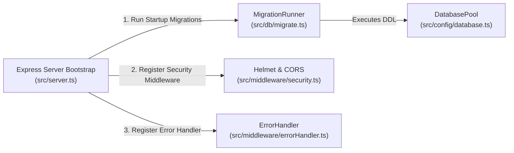

# Logical Components & Module Architecture — Unit U05 (u05-core-foundation)

## Sources
- Security Design: `security-design.md` (nfr-design)
- Tech Stack Decisions: `tech-stack-decisions.md` (nfr-requirements)
- Unit Definitions: `unit-of-work.md` (units-generation)
- Contracts: `contract-summary.md` (contract-design)

---

## 1. Foundation Library Components

| Logical Component | Target File Path | Responsibilities | Key Exports |
|---|---|---|---|
| **DatabasePool** | `src/config/database.ts` | Configures `pg.Pool` connection pool, connection retry, and pool shutdown lifecycle | `getPool()`, `closePool()`, `query()` |
| **MigrationRunner** | `src/db/migrate.ts` | Reads SQL files from `/migrations`, executes DDL in transactions, tracks executed files | `runMigrations()` |
| **TransactionHelper** | `src/utils/transaction.ts` | Wraps multi-statement operations in `BEGIN`/`COMMIT`/`ROLLBACK` blocks | `withTransaction(callback)` |
| **ApiError & ErrorMiddleware** | `src/middleware/errorHandler.ts` | Custom error subclass and Express error handling middleware | `ApiError`, `errorHandler` |
| **Theme & Style Tokens** | `tailwind.config.js`, `src/styles/theme.css` | High-contrast CSS variables, solid card theme classes, zero glassmorphism | Tailwind theme config, `.card-solid` |

---

## 2. Module Interaction Flow

