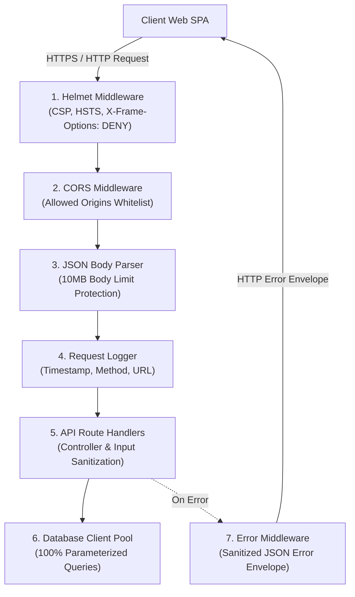

# Security Architecture & Middleware Design — Unit U05 (u05-core-foundation)

## Sources
- Security Requirements: `security-requirements.md` (nfr-requirements)
- Tech Stack Decisions: `tech-stack-decisions.md` (nfr-requirements)
- Functional Spec: `functional-spec.md` (functional-design)
- Contracts: `contract-summary.md` (contract-design)

---

## 1. Security Architecture & Middleware Pipeline

The security architecture implements a defense-in-depth model across the HTTP network layer, application routing, and database persistence layers.



---

## 2. Technical Security Specifications

### 1. Parameterized Database Access
All SQL queries executed via the PostgreSQL pool (`pg.Pool`) strictly use parameterized placeholders (`$1`, `$2`, etc.) passed in the values array:
```typescript
// Enforced pattern across all repositories:
const result = await pool.query(
  'SELECT * FROM employees WHERE id = $1',
  [employeeId]
);
```

### 2. HTTP Security Headers (Helmet Configuration)
- `X-Content-Type-Options: nosniff` (prevents MIME-type sniffing)
- `X-Frame-Options: DENY` (prevents clickjacking attacks)
- `X-XSS-Protection: 0` (modern standard disabling legacy buggy filter in favor of CSP)
- `Content-Security-Policy`: default-src 'self'

### 3. Cross-Origin Resource Sharing (CORS)
- Origin whitelist: configured for local development (`http://localhost:5173`, `http://localhost:3000`) with support for environment-driven production origins.
- Allowed Methods: `GET, POST, PUT, PATCH, DELETE, OPTIONS`.
- Allowed Headers: `Content-Type, Authorization`.

### 4. Error Sanitization & Masking
- The global error handler catches all uncaught exceptions.
- In production, internal database error details and stack traces are logged server-side only; client responses contain only the safe error code and message.
