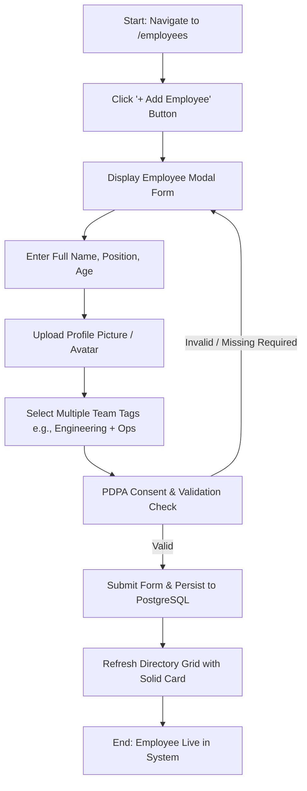
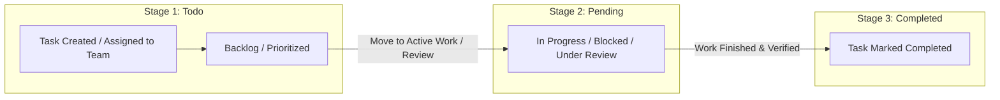

# User Journey Flows & Navigation Diagrams

## Sources
- Initial description: [desc]
- Scope definition: [scope]
- Intent backlog: [backlog]
- Clarifying questions: [Q1], [Q2], [Q3], [Q4], [Q5]

---

## 1. Primary User Journey Overview

The application features three core workflows mapped to administrative and management personas [desc] [scope]:
1. **Employee Management Flow**: Onboarding, profile maintenance, multi-team membership tagging, photo uploading.
2. **Team & Task Management Flow**: Team creation, task authoring, and three-stage state transitions (`Todo` -> `Pending` -> `Completed`).
3. **Executive Analytics Flow**: Metric inspection, workload breakdown, task distribution monitoring.

```
+----------------------------------------------------------------------------------------------------+
|                                      APPLICATION NAVIGATION FLOW                                   |
+----------------------------------------------------------------------------------------------------+
|                                                                                                    |
|                                       +--------------------+                                       |
|                                       |     APP ENTRY      |                                       |
|                                       +---------+----------+                                       |
|                                                 |                                                  |
|                                                 v                                                  |
|                                     +----------------------+                                       |
|                                     | Executive Dashboard  |                                       |
|                                     | (/dashboard)         |                                       |
|                                     +---+-------+-------+--+                                       |
|                                         |       |       |                                          |
|                 +-----------------------+       |       +------------------------+                 |
|                 v                               v                                v                 |
|      +---------------------+         +--------------------+          +---------------------+       |
|      | Employee Directory  |         |  Teams Management  |          |  Task Board (Kanban)|       |
|      | (/employees)        |         |  (/teams)          |          |  (/tasks)           |       |
|      +----------+----------+         +----------+---------+          +----------+----------+       |
|                 |                               |                               |                  |
|                 v                               v                               v                  |
|      +---------------------+         +--------------------+          +---------------------+       |
|      | - Profile Details   |         | - Team Detail View |          | - Stage Transition  |       |
|      | - Add/Edit Modal    |         | - Member Allocation|          |   (Todo/Pend/Done)  |       |
|      | - Multi-Team Assign |         | - Team Task Board  |          | - Task Modal        |       |
|      +---------------------+         +--------------------+          +---------------------+       |
|                                                                                                    |
+----------------------------------------------------------------------------------------------------+
```

---

## 2. Journey 1: Employee Onboarding & Multi-Team Assignment Flow

This flow covers creating an employee profile with Thai PDPA compliance checks and assigning the employee to multiple functional teams [desc] [Q1] [Q2].



### Detailed Step-by-Step Actions:
1. **Entry**: Admin clicks `+ Add Employee` in top action bar.
2. **Input Fields**:
   - `Name`: String (required).
   - `Position`: String (required).
   - `Age`: Integer (positive number, required).
   - `Profile Picture`: Image upload with preview (stored securely).
   - `Team Memberships`: Multi-select dropdown tagger (supports 1..N team associations).
3. **Validation**: Form validates non-empty fields, valid age range, and accepted image MIME types.
4. **Outcome**: Profile persisted to backend; instant optimistic or reactive UI update in Directory card grid.

---

## 3. Journey 2: Task Lifecycle & Kanban State Progression Flow

This flow tracks a team task moving across the strict three-stage lifecycle: `Todo` -> `Pending` -> `Completed` [desc] [Q1] [Q3].



### Flow Breakdown & Transitions:
- **State 1: Todo**: Newly created task assigned to a specific team. Awaiting pickup or scheduling.
- **State 2: Pending**: Task actively underway, awaiting dependencies, or in code review/QA.
- **State 3: Completed**: Work finalized and approved. Updates executive completion rates on Dashboard.

---

## 4. Journey 3: Executive Analytics & Dashboard Exploration Flow

This flow illustrates how company leadership reviews organizational metrics, team capacities, and company-wide velocity [desc] [Q4].

```
+-------------------+      +--------------------------+      +---------------------------+
| 1. Open Dashboard | ---> | 2. Inspect Top KPI Cards | ---> | 3. Drill-Down by Filter   |
|    (/dashboard)   |      |    - Total Employees     |      |    - Select Team          |
|                   |      |    - Active Teams        |      |    - View Stage Breakdown |
|                   |      |    - Tasks Breakdown     |      |    - Export/Inspect KPIs  |
+-------------------+      +--------------------------+      +---------------------------+
```

---

## 5. Information Architecture & Navigation Hierarchy

```
Root App Container
├── Global Top Bar (Brand, Search, Theme Mode, Profile)
└── App Layout
    ├── Sidebar Navigation
    │   ├── [Dashboard]  --> /dashboard (Metrics, KPIs, Progress Bars)
    │   ├── [Employees]  --> /employees (Grid/Table Views, Filter, Profile Modal)
    │   ├── [Teams]      --> /teams (Team Summary Cards, Member Roster, Team Tasks)
    │   └── [Tasks]      --> /tasks (3-Column Kanban Board: Todo, Pending, Completed)
    └── Content Viewport
        └── Responsive Solid Card Containers (No glassmorphism, crisp contrast)
```
