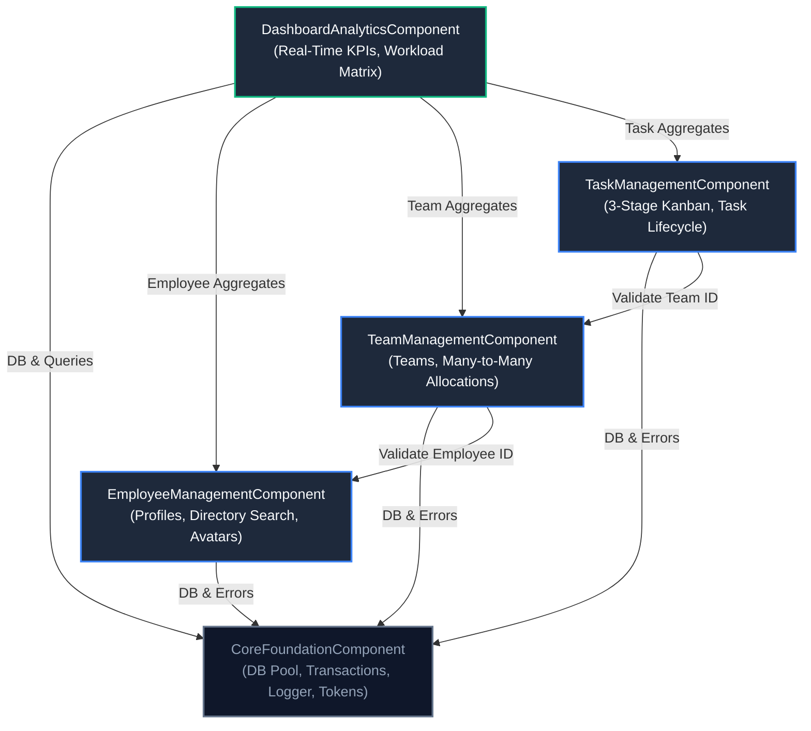

# Domain Component Catalogue & System Architecture

## Sources
- Requirements: `requirements.md` (requirements-analysis)
- User Stories: `stories.md` (user-stories)
- Team Practices: `team-practices.md` (practices-discovery)
- Refined Mockups: `mockups.md` (refined-mockups)

---

## 1. Machine-Readable Component Catalogue

```yaml
components:
  - name: EmployeeManagementComponent
    summary: Manages employee profiles, search, filtering, and avatar references
    behaviour: >
      Enforces validation rules for employee creation and updates (positive age, non-empty full name and position).
      Coordinates avatar file storage references and provides multi-field text search across directory profiles.
    responsibilities:
      - Employee profile creation, retrieval, updates, and deletion
      - Avatar image metadata and public URL referencing
      - Real-time directory search and team membership filtering
    depends_on:
      - component: CoreFoundationComponent
        interaction: Database access, transaction management, and logging
        style: sync
    dependents:
      - component: TeamManagementComponent
        interaction: Queries employee profiles to populate team roster cards
      - component: DashboardAnalyticsComponent
        interaction: Queries employee counts and active roster records
    external_dependencies:
      - name: PostgreSQL
        kind: database
        purpose: Persistent storage of employees table
      - name: LocalDisk/S3Storage
        kind: object-store
        purpose: Binary storage of uploaded employee avatar photos
    entities:
      - name: Employee
        identifier: id
        attributes: [id, full_name, position, age, avatar_url, created_at, updated_at]

  - name: TeamManagementComponent
    summary: Manages functional team definitions, rosters, and many-to-many employee allocations
    behaviour: >
      Maintains functional team records and manages many-to-many associations between employees and teams.
      Enforces referential integrity such that removing team associations does not delete underlying employee records.
    responsibilities:
      - Team creation, retrieval, updates, and roster views
      - Many-to-Many employee-to-team assignment and unlinking
      - Team membership count and avatar stack aggregation
    depends_on:
      - component: EmployeeManagementComponent
        interaction: Validates employee existence during team assignment
        style: sync
      - component: CoreFoundationComponent
        interaction: Database access and transaction management
        style: sync
    dependents:
      - component: TaskManagementComponent
        interaction: Validates assigned team ID for task allocation
      - component: DashboardAnalyticsComponent
        interaction: Queries team counts and active team rosters
    external_dependencies:
      - name: PostgreSQL
        kind: database
        purpose: Persistent storage of teams and employee_teams join tables
    entities:
      - name: Team
        identifier: id
        attributes: [id, name, description, created_at, updated_at]
      - name: EmployeeTeamAssignment
        identifier: id
        attributes: [id, employee_id, team_id, assigned_at]
        references:
          - entity: Employee
            owned_by: EmployeeManagementComponent
            relationship: "each assignment links one Employee to a Team"
          - entity: Team
            owned_by: TeamManagementComponent
            relationship: "each assignment links to one Team"

  - name: TaskManagementComponent
    summary: Manages team tasks, priority assignment, and strict 3-stage Kanban lifecycle
    behaviour: >
      Enforces a strict 3-stage finite state lifecycle (Todo -> Pending -> Completed).
      Guarantees every task is allocated to a valid functional team. Prevents invalid status transitions.
    responsibilities:
      - Task creation, editing, and team allocation
      - 3-stage lifecycle transition enforcement (Todo, Pending, Completed)
      - Kanban board state queries grouped by status column
    depends_on:
      - component: TeamManagementComponent
        interaction: Validates team ID during task creation and assignment
        style: sync
      - component: CoreFoundationComponent
        interaction: Database access and transaction management
        style: sync
    dependents:
      - component: DashboardAnalyticsComponent
        interaction: Queries task counts by lifecycle stage and team workload
    external_dependencies:
      - name: PostgreSQL
        kind: database
        purpose: Persistent storage of tasks table
    entities:
      - name: Task
        identifier: id
        attributes: [id, title, description, team_id, priority, status, created_at, updated_at]
        references:
          - entity: Team
            owned_by: TeamManagementComponent
            relationship: "each Task is assigned to exactly one Team"

  - name: DashboardAnalyticsComponent
    summary: Aggregates real-time organization metrics, KPI summaries, and team workload matrices
    behaviour: >
      Executes optimized read-only queries to calculate top-level organizational KPIs,
      task distribution across lifecycle stages, and team capacity and workload breakdowns.
    responsibilities:
      - Top-level KPI computation (Total Employees, Active Teams, Total Tasks, Completion Rate %)
      - Task distribution aggregation by lifecycle stage
      - Team workload calculation and capacity summaries
    depends_on:
      - component: EmployeeManagementComponent
        interaction: Queries total employee count
        style: sync
      - component: TeamManagementComponent
        interaction: Queries total active teams and member rosters
        style: sync
      - component: TaskManagementComponent
        interaction: Queries task counts, statuses, and team assignments
        style: sync
      - component: CoreFoundationComponent
        interaction: Database access and query optimization
        style: sync
    dependents: []
    external_dependencies:
      - name: PostgreSQL
        kind: database
        purpose: Read-only aggregation queries
    entities: []

  - name: CoreFoundationComponent
    summary: Provides shared database connectivity, transaction management, error handling, and design system tokens
    behaviour: >
      Provides centralized PostgreSQL connection pool, ACID transaction utilities, structured logging,
      uniform HTTP error handling, and shared UI design system configuration adhering to solid opaque styling.
    responsibilities:
      - PostgreSQL connection pooling and transaction lifecycle
      - Centralized error handling and API response normalization
      - Media asset storage abstraction
      - Design token definitions (colors, contrast, typography)
    depends_on: []
    dependents:
      - component: EmployeeManagementComponent
        interaction: Uses DB pool, transaction helper, and error handler
      - component: TeamManagementComponent
        interaction: Uses DB pool, transaction helper, and error handler
      - component: TaskManagementComponent
        interaction: Uses DB pool, transaction helper, and error handler
      - component: DashboardAnalyticsComponent
        interaction: Uses DB pool and query execution helpers
    external_dependencies:
      - name: PostgreSQL
        kind: database
        purpose: Connection pool and transaction boundary
    entities: []
```

---

## 2. Component Diagram



---

## 3. Component Summary

| Component | Purpose | Depends On | Dependents | Entities Owned |
|---|---|---|---|---|
| **EmployeeManagementComponent** | Employee profile CRUD, avatar URLs, real-time search & team filtering | `CoreFoundationComponent` | `TeamManagementComponent`, `DashboardAnalyticsComponent` | `Employee` |
| **TeamManagementComponent** | Team CRUD, roster breakdown, and many-to-many employee allocation | `EmployeeManagementComponent`, `CoreFoundationComponent` | `TaskManagementComponent`, `DashboardAnalyticsComponent` | `Team`, `EmployeeTeamAssignment` |
| **TaskManagementComponent** | Task CRUD, team assignment, and strict 3-stage Kanban transitions | `TeamManagementComponent`, `CoreFoundationComponent` | `DashboardAnalyticsComponent` | `Task` |
| **DashboardAnalyticsComponent** | Real-time calculation of KPIs, task distribution, and team workload | `EmployeeManagementComponent`, `TeamManagementComponent`, `TaskManagementComponent`, `CoreFoundationComponent` | None | None (Read-only Analytical Projections) |
| **CoreFoundationComponent** | Shared DB connection pool, transactions, error handling, and design tokens | None | `EmployeeManagementComponent`, `TeamManagementComponent`, `TaskManagementComponent`, `DashboardAnalyticsComponent` | None (Shared Infrastructure/Kernel) |

---

## 4. Entity Ownership

| Entity | Owning Component | Identifier | Attributes | References |
|---|---|---|---|---|
| **Employee** | `EmployeeManagementComponent` | `id` | `id`, `full_name`, `position`, `age`, `avatar_url`, `created_at`, `updated_at` | None |
| **Team** | `TeamManagementComponent` | `id` | `id`, `name`, `description`, `created_at`, `updated_at` | None |
| **EmployeeTeamAssignment** | `TeamManagementComponent` | `id` | `id`, `employee_id`, `team_id`, `assigned_at` | `Employee` (owned by `EmployeeManagementComponent`), `Team` (owned by `TeamManagementComponent`) |
| **Task** | `TaskManagementComponent` | `id` | `id`, `title`, `description`, `team_id`, `priority`, `status`, `created_at`, `updated_at` | `Team` (owned by `TeamManagementComponent`) |

---

## 5. External Dependencies

| Component | Dependency | Kind | Purpose |
|---|---|---|---|
| **EmployeeManagementComponent** | PostgreSQL | database | Table `employees` storage and index searches |
| **EmployeeManagementComponent** | LocalDisk/S3Storage | object-store | Binary photo upload storage |
| **TeamManagementComponent** | PostgreSQL | database | Tables `teams` and `employee_teams` join table |
| **TaskManagementComponent** | PostgreSQL | database | Table `tasks` with foreign key to `teams` |
| **DashboardAnalyticsComponent** | PostgreSQL | database | Read-only SQL aggregation queries and counts |
| **CoreFoundationComponent** | PostgreSQL | database | Connection pool client and transaction lifecycle |

---

## 6. Rationale

| Component | Rationale & Boundary Decision |
|---|---|
| **EmployeeManagementComponent** | Encapsulates distinct HR employee lifecycle, personal data validation, and directory search. Separated from teams to allow employees to exist independently without active team assignments. |
| **TeamManagementComponent** | Encapsulates organizational team structure and the many-to-many join relationship. Separating team allocation logic prevents coupling team metadata with individual employee profiles. |
| **TaskManagementComponent** | Encapsulates operational task tracking and the strict 3-stage finite state machine (`Todo` &rarr; `Pending` &rarr; `Completed`). Distinct change velocity from static personnel data. |
| **DashboardAnalyticsComponent** | Read-only aggregation concern. Decoupled from transactional write paths to optimize query performance and isolate analytics calculation logic from core domain entities. |
| **CoreFoundationComponent** | Centralizes cross-cutting concerns (DB connection pooling, transaction wrappers, structured error handling, design tokens) to ensure uniform reliability and code style across all domain modules. |
