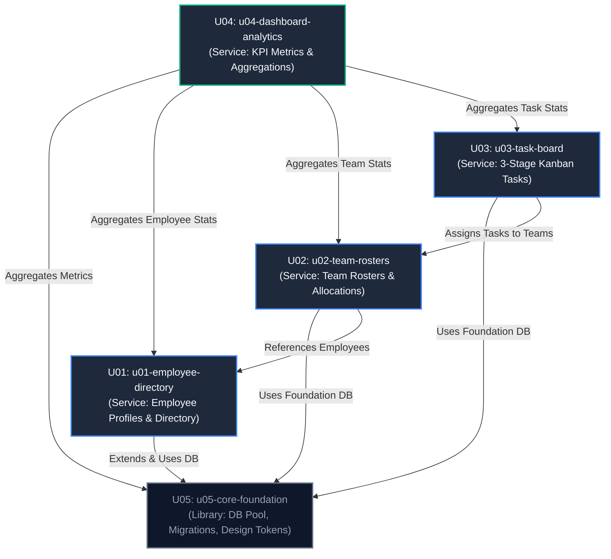

# Units of Work Dependency DAG & Topology

## Sources
- Unit Definitions: `unit-of-work.md` (units-generation)
- Component Architecture: `components.md` (domain-design)
- Architecture Decisions: `decisions.md` (domain-design)
- Team Practices: `team-practices.md` (practices-discovery)

---

## 1. Machine-Readable Dependency Graph

```yaml
units:
  - name: u05-core-foundation
    kind: library
    depends_on: []
  - name: u01-employee-directory
    kind: service
    depends_on:
      - u05-core-foundation
  - name: u02-team-rosters
    kind: service
    depends_on:
      - u01-employee-directory
      - u05-core-foundation
  - name: u03-task-board
    kind: service
    depends_on:
      - u02-team-rosters
      - u05-core-foundation
  - name: u04-dashboard-analytics
    kind: service
    depends_on:
      - u01-employee-directory
      - u02-team-rosters
      - u03-task-board
      - u05-core-foundation
```

---

## 2. Dependency Diagram



---

## 3. Walking Skeleton Integration Slice

In accordance with the affirmed team practice, **Unit U05 (`u05-core-foundation`) and Unit U01 (`u01-employee-directory`)** constitute the **Walking Skeleton**. 

This initial integrated slice will be constructed, deployed, and verified with automated integration tests first to prove:
1. PostgreSQL container connectivity and automated schema migration execution.
2. Express/Fastify REST API server bootstrap and standardized error handling.
3. React / Tailwind CSS solid-card UI layout rendering with high-contrast tokens.
4. End-to-end employee record persistence and directory display.

Subsequent units (`U02`, `U03`, `U04`) build on top of this verified foundation.

---

## 4. Integration Points & Data Contracts

| Consumer Unit | Provider Unit | Integration Mechanism | Contract Description |
|---|---|---|---|
| `u01-employee-directory` | `u05-core-foundation` | Shared TypeScript Library | Uses database pool (`getPool()`), transaction helper (`withTransaction()`), and base CSS token variables. |
| `u02-team-rosters` | `u01-employee-directory` | Relational FK & Service Lookup | References `employee_id` in `employee_teams` join table; verifies employee existence. |
| `u03-task-board` | `u02-team-rosters` | Relational FK & Service Lookup | References `team_id` in `tasks` table; validates active team before task creation. |
| `u04-dashboard-analytics` | `u01`, `u02`, `u03`, `u05` | SQL Aggregation Queries | Executes read-only multi-table joins and aggregation functions (`COUNT`, `SUM`, `AVG`) across normalized domain tables. |

---

## 5. Parallel Development & Topology Analysis

- **Topological Sorting**: `U05` &rarr; `U01` &rarr; `U02` &rarr; `U03` &rarr; `U04`.
- **DAG Characteristics**: Acyclic, single root (`U05`), single analytical sink (`U04`).
- **Parallel Opportunities**: Once `U02` is completed, work on UI components for `U03` and aggregation queries for `U04` can proceed in parallel against mocked or existing table schemas.
